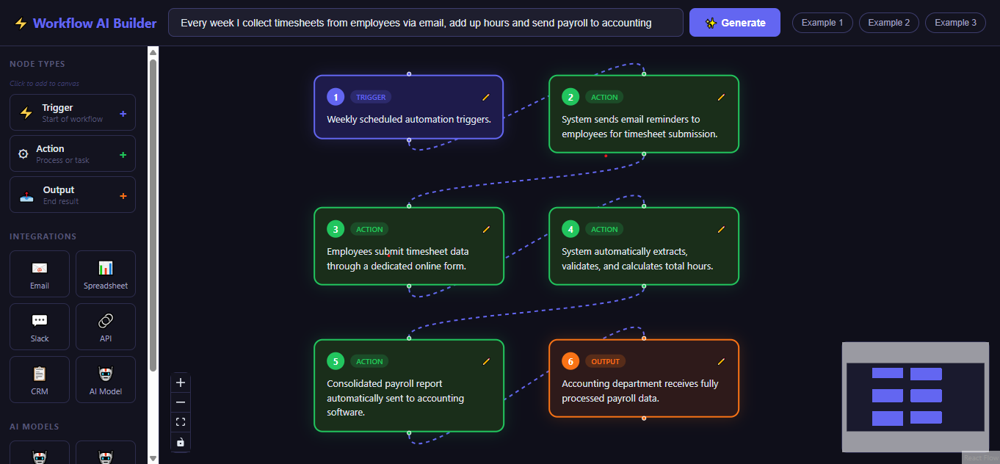

# AI Workflow Builder

An AI-powered web application that transforms messy manual business workflows into clean, structured automation plans instantly.

## Live Demo
> Run locally following the setup instructions below.

## Screenshot

## What it does
Paste a description of any manual business process and the app generates:
- A clear summary of the workflow
- A step-by-step automation plan
- Tool recommendations (Zapier, Make, Power Automate, etc.)

## Tech Stack
- **Frontend:** React, Axios, CSS3
- **Backend:** Node.js, Express
- **AI:** Google Gemini API
- **Other:** REST API, CORS, dotenv

## Getting Started

### Prerequisites
- Node.js installed
- Google Gemini API key (free at aistudio.google.com)

### Installation

1. Clone the repo
git clone https://github.com/toobahasnain/ai-workflow-builder.git

2. Setup backend
cd server
npm install

3. Create .env file in server folder
GEMINI_API_KEY=your_api_key_here
PORT=5000

4. Start the backend
node server.js

5. Setup frontend (new terminal)
cd client
npm install
npm start

6. Open your browser at http://localhost:3000

## Author
Syeda Tooba Hasnain
- LinkedIn: https://www.linkedin.com/in/syeda-tooba-hasnain-a9a17119a/